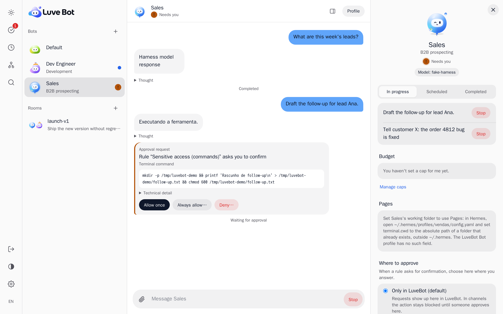
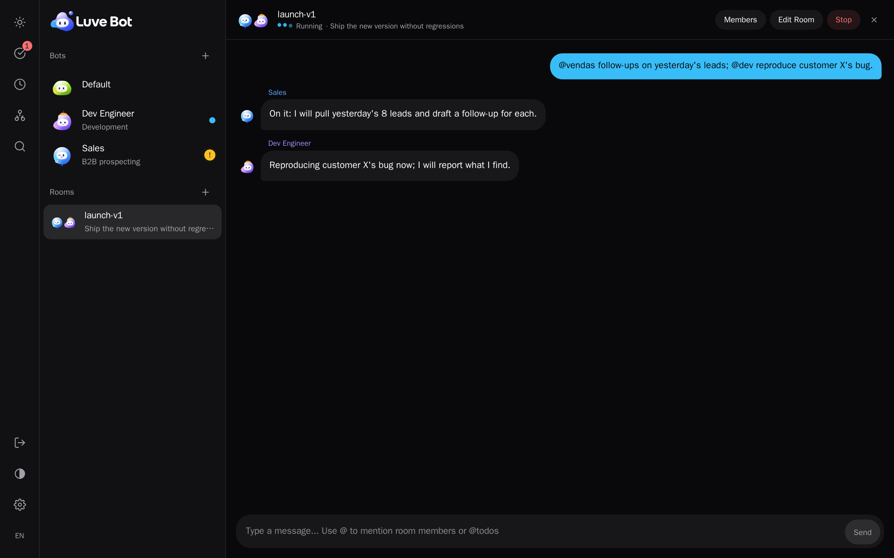
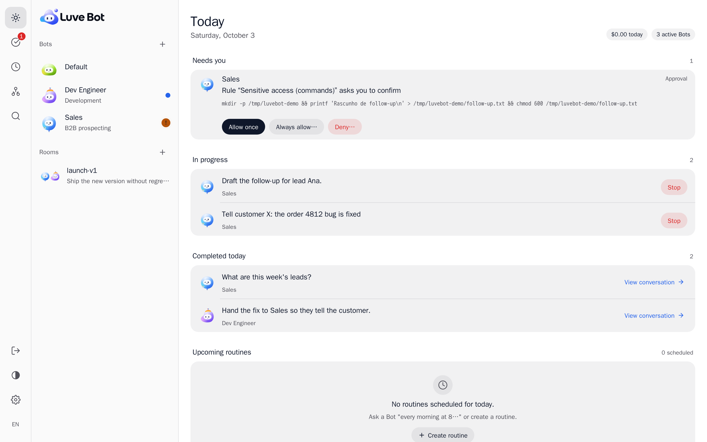
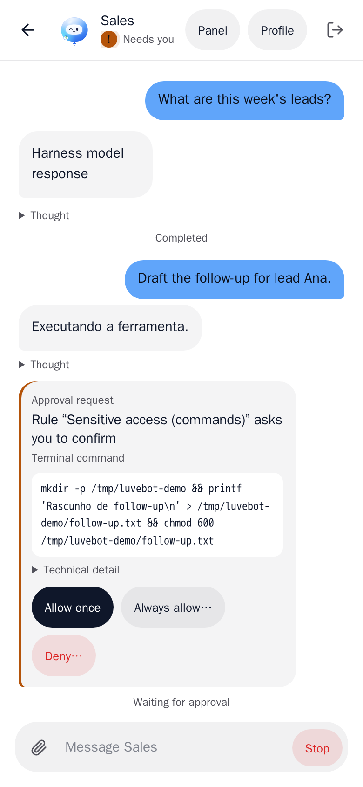

English · [Português](README.pt-BR.md)

# LuveBot

> The Grok Bot, Dots and Cue experience on the Hermes you already run.

LuveBot by Luve AIgency is an open-source mission control for teams of Hermes agents. It is a plugin for the Hermes dashboard that brings conversations, shared rooms, visible work, human approvals and spending controls into one interface on your own server.

**Status: pre-release, under development.** There is no tagged release yet. See [What is in the repository](#what-is-in-the-repository) and the [Roadmap](#roadmap).

## Preview

> **Test setup, not a real account.** These are real captures of LuveBot installed on Hermes in our test environment. The Bots, the room and the messages were made through the app; the Bots' answers come from a test model, which is why some replies read "Harness model response" or stay in Portuguese. The interface is still being refined, and these images will be redone when it is.

<picture>
  <source media="(prefers-color-scheme: dark)" srcset="docs/images/conversation-profile-dark-en.png">
  
</picture>

*Bots are colleagues: approvals and the Bot's profile live inside the conversation.*



*Rooms are group chats: one message with @mentions reaches each Bot, and each one signs its answer.*



*Today: what needs you, what is running and what is done, in one screen.*

<p align="center">
<picture>
  <source media="(prefers-color-scheme: dark)" srcset="docs/images/mobile-conversation-dark-en.png">
  
</picture>
</p>

<p align="center"><em>On a phone, the conversation and its approvals work the same way.</em></p>

## Why LuveBot

- **Rules that really block.** LuveBot enforces rules through a small plugin that Hermes loads in each Bot's profile and that runs before every tool call. Every rule shows an honest seal of what it actually is: a real block, a real approval, guidance only, or broken (the seal contradicts the live state of Hermes). Guidance is never presented as enforcement.
- **A human approves.** No LuveBot code approves anything on its own. An approval is tied to the exact call it was asked for and can be used once. You allow once, deny with a reason, edit or decide in batch. "Always allow" only creates a draft rule that a person must review.
- **Spending caps that pause.** When a Bot hits its cap, LuveBot pauses that Bot's Hermes cron jobs and refuses new runs for it. Raising or removing a cap, or resuming a paused Bot, requires a signed-in session. Caps are not an exact billing ceiling; [SECURITY.md](SECURITY.md) lists the limits. A paused Bot still answers messages on Telegram and its other channels (its Hermes gateway): only LuveBot's own entry points and the Bot's cron jobs are closed.
- **Audited.** Every action with an effect is recorded in LuveBot's own database: who, what, when and from where. The log is append-only and hash-chained, so changes can be detected (tamper-evident, not tamper-proof).
- **Inside the Hermes dashboard, no new port.** LuveBot is a dashboard plugin. It sits behind the dashboard's login, opens no server or port of its own, and keeps API keys and `.env` values on the server; they never reach the browser.

## What it is

LuveBot is the experience and control layer. A Bot maps to a Hermes profile; conversations use Hermes sessions, rooms use Hermes's native Group Chat, routines use Hermes cron, and handoffs use Hermes Kanban. LuveBot is designed to expose those capabilities and add a unified interface, rules, budgets and aggregated auditing.

Hermes remains responsible for the runtime: agents, tools, memory, cron, gateway, native approvals and execution security. LuveBot does not build a runtime, sandbox, tool gateway, secrets vault, wallet or telephone service.

## What is in the repository

Built, with tests (the backend against a real Hermes), but not yet released:

- A messenger-style home: Today, the list of Bots with what needs you, and each Bot's profile.
- Creating a Bot from a template, ending with the Bot introducing itself.
- Streaming conversations with tool steps, subagents, approvals inside the conversation, a work panel (Activity, Terminal, Files) and Stop.
- An approval inbox, and rules with seals, drafts and a simulator, enforced by the per-profile rules plugin.
- Activity View as a list and as a Kanban board, routines with their full run history and a test run, and costs with spending caps that pause.
- Rooms on Hermes's native Group Chat with `@` routing to members, handoffs through Hermes Kanban, a team map and search with a command palette (`⌘K`).
- Settings, the Luve theme, an installable PWA, Portuguese and English, and keyboard accessibility.

## Requirements for v0.1

- An existing [Hermes Agent](https://github.com/NousResearch/hermes-agent) installation with its dashboard and an API Server available for each profile you want to operate.
- The Hermes dashboard behind its login (a non-loopback bind with authentication) to decide approvals, loosen rules, raise or remove a cap, or resume a paused Bot. On a local dashboard (loopback) Hermes has no login, so LuveBot shows all of that read-only. Treat every person with dashboard access as a full operator.
- Hermes 2026.9.24: tested with Hermes 2026.9.24; newer releases are expected to work but have not been validated.
- For the planned live Screen tab: Hermes on **Linux with Xvnc and Xfce**. Without that setup, the planned fallback is an explanation and available browser screenshots.

Hermes profiles are not sandboxes. Read [SECURITY.md](SECURITY.md) for the trust boundaries and the limits of approvals and budgets.

## Installation

LuveBot is a Hermes dashboard plugin. Installing it means putting this repository in Hermes's plugin directory, installing the Luve theme, enabling the plugin and restarting the dashboard. It adds no server and no port.

> **Approvals need a login.** The restart command below starts a local dashboard: `hermes dashboard --no-open` binds 127.0.0.1 (loopback). That is fine to try LuveBot. But Hermes asks for no login on loopback, so LuveBot shows approvals read-only and will not let you decide them, loosen rules, raise or remove a cap, or resume a paused Bot.
>
> To decide approvals, give the dashboard Hermes's password login and bind it outside loopback:
>
> ```sh
> # `python` here is the Python that runs Hermes (see "Install" below for how to find it).
> hermes config set dashboard.basic_auth.username "your-name"
> hermes config set dashboard.basic_auth.password_hash "$(python -c "from plugins.dashboard_auth.basic import hash_password; print(hash_password('your-password'))")"
> hermes config set dashboard.basic_auth.secret "$(python -c "import secrets; print(secrets.token_hex(32))")"
> hermes dashboard --host 0.0.0.0 --no-open
> ```
>
> - Hermes turns the login on only for a non-loopback bind (`--host`). On 127.0.0.1 there is no login, even with `basic_auth` set.
> - Hermes refuses a non-loopback bind with no login configured.
> - The `secret` keeps you signed in across dashboard restarts.
> - Hermes serves plain HTTP. If other machines can reach it, put it behind HTTPS (a reverse proxy or a tunnel).
> - Hermes's OAuth login (`hermes dashboard register`, Nous Portal) also works.

> The commands below clone the official repository, `https://github.com/LucasVenuto/LuveBot.git` (or use a local path to a copy of it). The dashboard bundle (`dashboard/dist/`) is committed, so no build step is needed.

### Prerequisites

- Hermes Agent release **2026.9.24**: tested with Hermes 2026.9.24; newer releases are expected to work but have not been validated. The plugin checks this baseline in its `/health` and reports older releases as unsupported. `hermes --version` shows the release.
- The Hermes dashboard (`hermes dashboard`). LuveBot sits behind its login. Deciding approvals, loosening rules, raising or removing a cap and resuming a paused Bot need the dashboard with a login (see **Approvals need a login** above). On a local dashboard (loopback) they are read-only.
- An API Server enabled for each profile you want to operate as a Bot (`API_SERVER_KEY` in that profile's `.env`). Without it LuveBot loads, but those Bots are reported unavailable.
- `git`, `curl` and a POSIX shell.

### Install

<!-- install-test: install -->
```sh
git clone "https://github.com/LucasVenuto/LuveBot.git" "${HERMES_HOME:-$HOME/.hermes}/plugins/luvebot"
cd "${HERMES_HOME:-$HOME/.hermes}/plugins/luvebot"
# Finds the Python that runs Hermes and checks it before changing anything (see below).
./scripts/install.sh
```

`scripts/install.sh` copies `luve.yaml` to `$HERMES_HOME/dashboard-themes/` and enables the plugin through Hermes's own activation code (`hermes_cli.plugins_cmd`). It does not edit Hermes's files by hand.

It also sets, through Hermes's own config writer, the documented `platform_hints.api_server` override in each Bot's profile so the Bot writes Markdown, which LuveBot renders safely (Hermes otherwise tells API Server agents to write plain text). A profile that already has its own `platform_hints.api_server` is left as it is. Bots created later get it at creation.

It runs that code with the Python that runs your Hermes, found in this order:
1. `HERMES_PYTHON`, if you set it: `HERMES_PYTHON=/path/to/python ./scripts/install.sh`.
2. The interpreter on the first line of the `hermes` command, when that is a Python (a pip or venv install).
3. Otherwise, the `hermes` command itself. The shell launcher that Hermes's installer writes (`#!/bin/sh`) runs a module with its own Python through `hermes --run-module`, the form Hermes uses for the commands it saves ([_launchers.py](https://github.com/NousResearch/hermes-agent/blob/f8489405/hermes_cli/_launchers.py#L73)). An older launcher that lacks it reports its runtime through `hermes --print-runtime-command`, the interface Hermes's own tools use ([_launchers.py](https://github.com/NousResearch/hermes-agent/blob/f8489405/hermes_cli/_launchers.py#L61)).

Before it copies or enables anything, the script checks that this Python really imports `hermes_cli.plugins_cmd`. If no candidate does, it stops with a message, changes nothing, and asks you to set `HERMES_PYTHON`. `HERMES_HOME` defaults to `~/.hermes`. Do not use `hermes plugins enable luvebot`: that command only knows agent plugins and answers "No plugin named 'luvebot'" for a dashboard plugin like this one.

### The rules plugin in every Bot

LuveBot enforces its rules through a small second plugin, `hermes-plugin/` (plugin name `luvebot-hook`), that Hermes loads **per profile**. LuveBot installs and enables it in each Bot's profile with Hermes's own plugin installer when you create a Bot, and, for Bots that already exist, when you ask for it (`POST /bots/{bot}/hook/install`). Two things follow:

- Hermes installs plugins from a **git commit**. Your clone of this repository must be a real git checkout whose `HEAD` contains the `hermes-plugin/` folder; changes you have not committed in that folder are not installed. If you develop in the clone, commit before creating Bots.
- A Bot created after the gateway started needs a short while (about 20 seconds) before the gateway loads its plugin. Until then LuveBot reports the Bot's rules as "waiting for the gateway" and refuses to start work on it; it does not need a restart.

### Restart the dashboard

The dashboard reads plugins at start. Stop it and start it again the way you normally run it; for example:

<!-- install-test: restart -->
```sh
hermes dashboard --stop
hermes dashboard --no-open
```

(`--stop` finds dashboard processes with `ps`; on a minimal image without `procps`, stop the process yourself.)

This starts a local (loopback) dashboard, where approvals are read-only. To decide them, start it with a login instead (see **Approvals need a login** above).

### Check that it works

<!-- install-test: verify -->
```sh
# No session: the plugin refuses. Expect 401.
curl -s -o /dev/null -w '%{http_code}\n' http://127.0.0.1:9119/api/plugins/luvebot/health
```

With a session, in a browser: open the dashboard. LuveBot replaces the home (`/`) and lists your Bots. If you run the dashboard behind its login (a non-loopback bind with authentication), a signed-in tab can also open `/api/plugins/luvebot/health` directly.

On a local dashboard (loopback bind) Hermes asks for no login, so LuveBot cannot tell a person from the machine: it shows approvals read-only and refuses to decide them (`403 loopback_not_human`), along with loosening rules, raising or removing a cap and resuming a paused Bot. To decide approvals, see **Approvals need a login** above.

On a local dashboard (loopback bind) the session is the token Hermes embeds in its own page; this reads `/health` with it:

<!-- install-test: verify2 -->
```sh
TOKEN="$(curl -s http://127.0.0.1:9119/ | sed -n 's/.*__HERMES_SESSION_TOKEN__="\([^"]*\)".*/\1/p')"
curl -s -H "X-Hermes-Session-Token: $TOKEN" http://127.0.0.1:9119/api/plugins/luvebot/health
```

Expect JSON with `"ok": true`, the plugin version and your Hermes release. If `hermes.baseline_ok` is `false`, update Hermes. Treat that token like a password; do not paste it anywhere.

### Uninstall

<!-- install-test: uninstall -->
```sh
"${HERMES_HOME:-$HOME/.hermes}/plugins/luvebot/scripts/install.sh" --uninstall
```

`--uninstall` disables the plugin through the same Hermes activation code as the install, removes the Luve theme and the plugin directory, and can be repeated (from another copy of the repository, since the first run removes this one). Because the repository is cloned into `plugins/luvebot`, `--uninstall` deletes that entire clone, including any local uncommitted changes; if you develop in it, copy your work out first.

Restart the dashboard afterwards. LuveBot's own data (its audit database and Bot display settings) stays in `$HERMES_HOME/luvebot/`; delete that folder too if you want it gone. Bots are ordinary Hermes profiles and are not removed.

For development checks, see [CONTRIBUTING.md](CONTRIBUTING.md). The installation above is exercised from a clean container by `tests/install/run.sh`.

## Backup and restore

LuveBot keeps its own data in `$HERMES_HOME/luvebot/luvebot.db`. Never copy that file with `cp` while the dashboard or a gateway runs: the copy can catch a half-written page and be corrupt from the start. Use the script, which copies through SQLite's backup API and keeps the copy only if `PRAGMA integrity_check` answers `ok`:

```sh
SCRIPT="${HERMES_HOME:-$HOME/.hermes}/plugins/luvebot/scripts/backup_luvebot.py"
python3 "$SCRIPT"                       # safe while everything runs; writes luvebot/backups/luvebot-<UTC time>.db (0600)
python3 "$SCRIPT" --check <backup.db>   # is this backup sound?
```

To restore:
1. Stop the dashboard (`hermes dashboard --stop`) and every gateway (`hermes gateway stop`, and `hermes -p <bot> gateway stop` for each Bot that runs its own).
2. Check the backup: `python3 "$SCRIPT" --check <backup.db>`. Use only one that answers `ok`.
3. Restore: `python3 "$SCRIPT" --restore <backup.db>`. It refuses a bad backup or a database still in use. The current database and its `-journal`, `-wal` and `-shm` files are moved aside together with a `.before-restore-<time>` suffix, never deleted, so no old journal is replayed into the restored file.
4. Start the gateways and the dashboard again.

## Live screen

Live screen: coming soon.

## Roadmap

### v0.1 — in progress

- The live Screen tab, including viewing and control from a phone. The server setup is written and waiting to be proven in a clean container; the tab itself has not shipped. This follows decision D-007, which brings it forward from the specification's later-release scope.
- Pausing and resuming a Bot by hand from its profile (pausing by spending cap already works).
- Visual refinement of every screen, and browser end-to-end tests of the new messenger-style interface.
- A first tagged release with a published compatibility range.

### v0.2 — planned follow-up

Granular memory management, a timeline with lanes, read-only proactive research, threads and reactions, Bot and rule suggestions, notifications in channels, cost projections, and automatic pause after inactivity.

## Contributing and governance

See [CONTRIBUTING.md](CONTRIBUTING.md), the [Code of Conduct](CODE_OF_CONDUCT.md) and [SECURITY.md](SECURITY.md). The contribution sign-off proposal is pending maintainer confirmation; the conduct contact is still TBD. Report vulnerabilities privately through [GitHub security advisories](https://github.com/LucasVenuto/LuveBot/security/advisories/new).

LuveBot's own code is [MIT licensed](LICENSE), Copyright (c) 2026 Luve AIgency. Hermes Agent is by Nous Research and uses MIT. The planned unmodified noVNC component uses MPL-2.0 with separately licensed files. See [NOTICE](NOTICE) and [THIRD_PARTY_LICENSES.md](THIRD_PARTY_LICENSES.md) for attribution and distribution details.

## Trademarks

Grok, Grok Bot, Dots, Cue, Hermes, Hermes Agent, Nous Research, noVNC and the other product and company names mentioned in this repository are trademarks of their respective owners. LuveBot is not affiliated with, sponsored by or endorsed by any of them. These names are used only to describe inspiration and compatibility. No code, artwork or trademark of theirs is included in this repository, except the unmodified third-party components listed in the NOTICE (noVNC).
