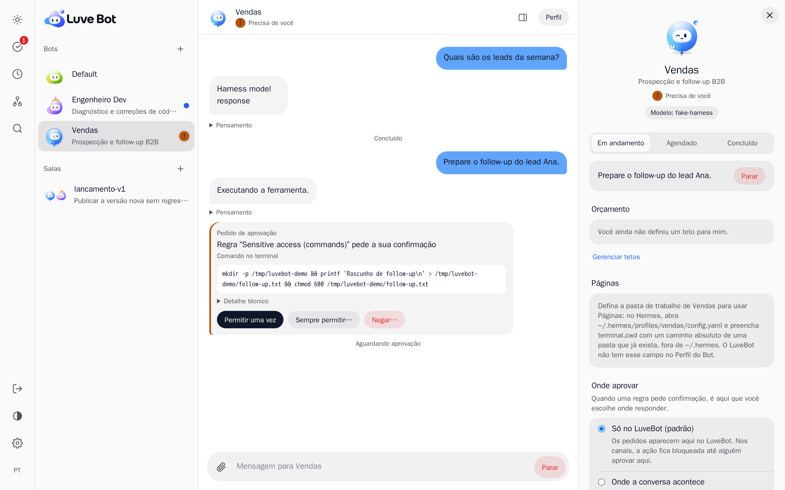
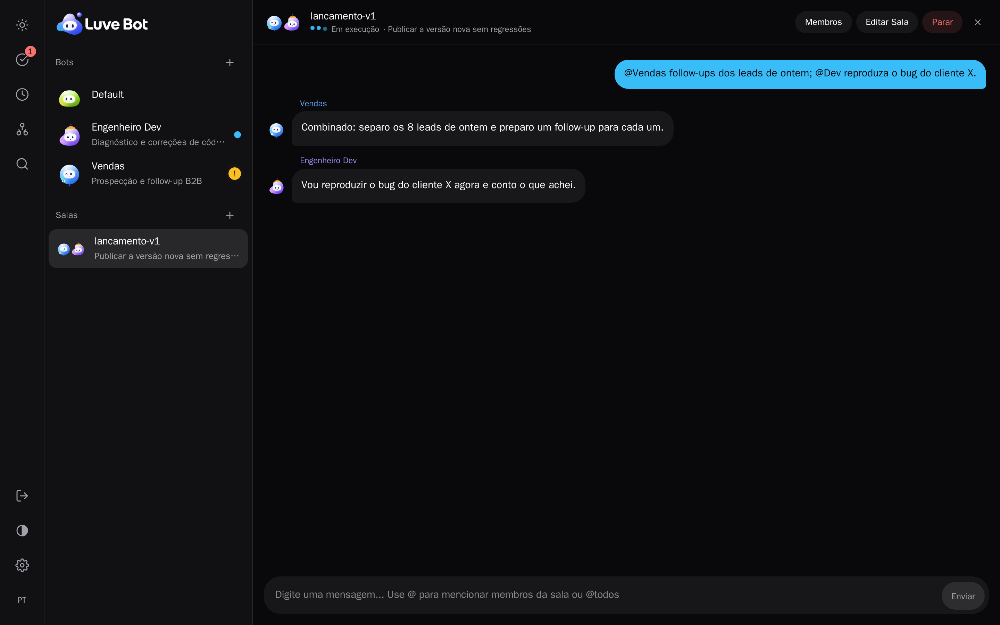
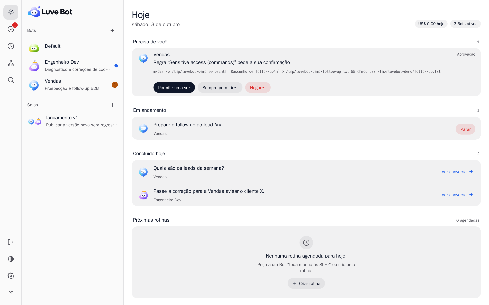
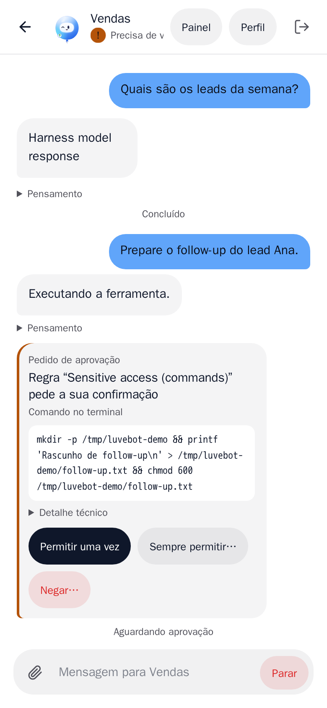

Português · [English](README.md)

# LuveBot

> A experiência do Grok Bot, do Dots e do Cue no Hermes que você já roda.

O LuveBot, da Luve AIgency, é um mission control open-source para times de agentes Hermes. É um plugin do dashboard do Hermes que reúne conversas, salas compartilhadas, trabalho visível, aprovações humanas e controle de gastos numa só interface, no seu próprio servidor.

**Status: pré-lançamento, em desenvolvimento.** Ainda não há versão publicada. Veja [O que já está no repositório](#o-que-já-está-no-repositório) e o [Roteiro](#roteiro).

## Prévia

> **Ambiente de teste, não uma conta real.** São capturas reais do LuveBot instalado no Hermes do nosso ambiente de teste. Os Bots, a sala e as mensagens foram criados pelo próprio app; as respostas dos Bots vêm de um modelo de teste, por isso algumas dizem "Harness model response". A interface ainda está sendo refinada, e as imagens serão refeitas quando estiver pronta.

<picture>
  <source media="(prefers-color-scheme: dark)" srcset="docs/images/conversation-profile-dark-pt.png">
  
</picture>

*Bots são colegas: as aprovações e o perfil do Bot ficam dentro da conversa.*



*Salas são chats em grupo: uma mensagem com @menções chega a cada Bot, e cada um assina a sua resposta.*



*Hoje: o que precisa de você, o que está rodando e o que terminou, numa tela só.*

<p align="center">
<picture>
  <source media="(prefers-color-scheme: dark)" srcset="docs/images/mobile-conversation-dark-pt.png">
  
</picture>
</p>

<p align="center"><em>No celular, a conversa e as aprovações funcionam do mesmo jeito.</em></p>

## Por que o LuveBot

- **Regras que bloqueiam de verdade.** O LuveBot aplica as regras por meio de um pequeno plugin que o Hermes carrega no perfil de cada Bot e que roda antes de cada chamada de ferramenta. Toda regra mostra um selo honesto do que ela é de fato: bloqueio real, aprovação real, só orientação, ou quebrada (o selo contradiz o estado vivo do Hermes). Orientação nunca é apresentada como bloqueio.
- **Quem aprova é uma pessoa.** Nenhum código do LuveBot aprova nada sozinho. A aprovação fica presa à chamada exata para a qual foi pedida e só vale uma vez. Você permite uma vez, nega com motivo, edita ou decide em lote. "Sempre permitir" só cria uma regra em rascunho, que uma pessoa precisa revisar.
- **Teto de gasto que pausa.** Quando um Bot estoura o teto, o LuveBot pausa os cron jobs desse Bot no Hermes e recusa novos runs dele. Subir ou remover um teto, ou retomar um Bot pausado, exige sessão com login. O teto não é um limite exato de cobrança; o [SECURITY.md](SECURITY.md) lista os limites. Um Bot pausado ainda responde mensagens no Telegram e nos outros canais (o gateway do Hermes): só as entradas do próprio LuveBot e os cron jobs do Bot ficam fechados.
- **Auditado.** Toda ação com efeito fica registrada no banco do próprio LuveBot: quem, o quê, quando e de onde. O registro só aceita inclusão e é encadeado por hash, então alterações podem ser detectadas (evidencia adulteração, não impede).
- **Dentro do dashboard do Hermes, sem porta nova.** O LuveBot é um plugin do dashboard. Fica atrás do login do dashboard, não abre servidor nem porta própria, e mantém as chaves de API e os valores do `.env` no servidor; eles nunca chegam ao navegador.

## O que é

O LuveBot é a camada de experiência e controle. Um Bot corresponde a um perfil do Hermes; as conversas usam sessões do Hermes, as salas usam o Group Chat nativo do Hermes, as rotinas usam o cron do Hermes e os handoffs usam o Kanban do Hermes. O LuveBot expõe essas capacidades e acrescenta uma interface unificada, regras, orçamentos e auditoria agregada.

O Hermes continua responsável pelo runtime: agentes, ferramentas, memória, cron, gateway, aprovações nativas e segurança de execução. O LuveBot não constrói runtime, sandbox, gateway de ferramentas, cofre de segredos, carteira nem serviço de telefone.

## O que já está no repositório

Construído, com testes (o backend contra um Hermes real), mas ainda não lançado:

- Uma home no estilo de mensageiro: Hoje, a lista de Bots com o que precisa de você, e o perfil de cada Bot.
- Criar um Bot a partir de um template, terminando com o Bot se apresentando.
- Conversas com streaming, passos de ferramenta, subagentes, aprovações dentro da conversa, um painel de trabalho (Atividade, Terminal, Arquivos) e Parar.
- Uma caixa de aprovações, e regras com selos, rascunhos e simulador, aplicadas pelo plugin de regras de cada perfil.
- Activity View em lista e em quadro Kanban, rotinas com o histórico completo de execuções e execução de teste, e custos com tetos de gasto que pausam.
- Salas sobre o Group Chat nativo do Hermes com roteamento por `@` para os membros, handoffs pelo Kanban do Hermes, mapa do time e busca com paleta de comandos (`⌘K`).
- Configurações, o tema Luve, PWA instalável, português e inglês, e acessibilidade por teclado.

## Requisitos da v0.1

- Uma instalação existente do [Hermes Agent](https://github.com/NousResearch/hermes-agent) com o dashboard e um API Server disponível para cada perfil que você quer operar.
- O dashboard do Hermes atrás do login dele (bind fora do loopback, com autenticação) para decidir aprovações, afrouxar regras, subir ou remover um teto e retomar um Bot pausado. Num dashboard local (loopback) o Hermes não tem login, então o LuveBot mostra tudo isso só para leitura. Trate toda pessoa com acesso ao dashboard como operador com acesso total.
- Hermes 2026.9.24: testado com o Hermes 2026.9.24; releases mais novas devem funcionar, mas ainda não foram validadas.
- Para a aba Tela ao vivo planejada: Hermes em **Linux com Xvnc e Xfce**. Sem esse ambiente, a alternativa planejada é uma explicação e as capturas do navegador disponíveis.

Perfis do Hermes não são sandboxes. Leia o [SECURITY.md](SECURITY.md) para entender as fronteiras de confiança e os limites das aprovações e dos orçamentos.

## Instalação

O LuveBot é um plugin do dashboard do Hermes. Instalar significa colocar este repositório na pasta de plugins do Hermes, instalar o tema Luve, ativar o plugin e reiniciar o dashboard. Ele não acrescenta servidor nem porta.

> **Aprovar exige login.** O comando de reinício abaixo sobe um dashboard local: `hermes dashboard --no-open` escuta em 127.0.0.1 (loopback). Serve para conhecer o LuveBot. Mas no loopback o Hermes não pede login, então o LuveBot mostra as aprovações só para leitura e não deixa decidi-las, afrouxar regras, subir ou remover um teto nem retomar um Bot pausado.
>
> Para decidir aprovações, ligue o login por senha do Hermes e suba o dashboard fora do loopback:
>
> ```sh
> # Aqui `python` é o Python que roda o Hermes (veja em "Instalar" como achá-lo).
> hermes config set dashboard.basic_auth.username "seu-nome"
> hermes config set dashboard.basic_auth.password_hash "$(python -c "from plugins.dashboard_auth.basic import hash_password; print(hash_password('sua-senha'))")"
> hermes config set dashboard.basic_auth.secret "$(python -c "import secrets; print(secrets.token_hex(32))")"
> hermes dashboard --host 0.0.0.0 --no-open
> ```
>
> - O Hermes só liga o login com bind fora do loopback (`--host`). Em 127.0.0.1 não há login, mesmo com `basic_auth` configurado.
> - O Hermes recusa bind fora do loopback sem login configurado.
> - O `secret` mantém você logado quando o dashboard reinicia.
> - O Hermes serve HTTP simples. Se outras máquinas alcançam o dashboard, coloque-o atrás de HTTPS (proxy reverso ou túnel).
> - O login OAuth do Hermes (`hermes dashboard register`, Nous Portal) também serve.

> Os comandos abaixo clonam o repositório oficial, `https://github.com/LucasVenuto/LuveBot.git` (ou use o caminho local de uma cópia dele). O bundle do dashboard (`dashboard/dist/`) vem commitado, então não é preciso build.

### Pré-requisitos

- Hermes Agent na release **2026.9.24**: testado com o Hermes 2026.9.24; releases mais novas devem funcionar, mas ainda não foram validadas. O plugin confere essa base no `/health` e mostra releases anteriores como não suportadas. `hermes --version` mostra a release.
- O dashboard do Hermes (`hermes dashboard`). O LuveBot fica atrás do login dele. Decidir aprovações, afrouxar regras, subir ou remover um teto e retomar um Bot pausado exigem o dashboard com login (veja **Aprovar exige login** acima). Num dashboard local (loopback) isso fica só para leitura.
- Um API Server ativado em cada perfil que você quer operar como Bot (`API_SERVER_KEY` no `.env` desse perfil). Sem ele o LuveBot carrega, mas esses Bots aparecem como indisponíveis.
- `git`, `curl` e um shell POSIX.

### Instalar

```sh
git clone "https://github.com/LucasVenuto/LuveBot.git" "${HERMES_HOME:-$HOME/.hermes}/plugins/luvebot"
cd "${HERMES_HOME:-$HOME/.hermes}/plugins/luvebot"
# Encontra o Python que roda o Hermes e confere antes de mudar qualquer coisa (veja abaixo).
./scripts/install.sh
```

O `scripts/install.sh` copia o `luve.yaml` para `$HERMES_HOME/dashboard-themes/` e ativa o plugin pelo próprio código de ativação do Hermes (`hermes_cli.plugins_cmd`). Ele não edita arquivos do Hermes à mão.

Ele também grava, pelo escritor de configuração do próprio Hermes, o ajuste documentado `platform_hints.api_server` no perfil de cada Bot, para o Bot escrever em Markdown, que o LuveBot mostra com segurança (sem isso o Hermes manda o agente do API Server escrever texto puro). Um perfil que já tenha o seu próprio `platform_hints.api_server` fica como está. Bots criados depois já nascem com ele.

Ele roda esse código com o Python que roda o seu Hermes, procurado nesta ordem:
1. O `HERMES_PYTHON`, se você definir: `HERMES_PYTHON=/caminho/do/python ./scripts/install.sh`.
2. O interpretador da primeira linha do comando `hermes`, quando ele é um Python (instalação por pip ou venv).
3. Senão, o próprio comando `hermes`. O launcher em shell que o instalador do Hermes grava (`#!/bin/sh`) roda um módulo com o próprio Python por `hermes --run-module`, a forma que o Hermes usa nos comandos que ele grava ([_launchers.py](https://github.com/NousResearch/hermes-agent/blob/f8489405/hermes_cli/_launchers.py#L73)). Um launcher mais antigo, sem essa opção, informa o runtime por `hermes --print-runtime-command`, a interface que as ferramentas do Hermes usam ([_launchers.py](https://github.com/NousResearch/hermes-agent/blob/f8489405/hermes_cli/_launchers.py#L61)).

Antes de copiar ou ativar qualquer coisa, o script confere se esse Python importa de fato o `hermes_cli.plugins_cmd`. Se nenhum candidato importa, ele para com uma mensagem, não muda nada e pede que você defina o `HERMES_PYTHON`. `HERMES_HOME` é `~/.hermes` por padrão. Não use `hermes plugins enable luvebot`: esse comando só conhece plugins de agente e responde "No plugin named 'luvebot'" para um plugin de dashboard como este.

### O plugin de regras em cada Bot

O LuveBot aplica as regras por meio de um segundo plugin pequeno, `hermes-plugin/` (nome do plugin `luvebot-hook`), que o Hermes carrega **por perfil**. O LuveBot instala e ativa esse plugin no perfil de cada Bot com o instalador de plugins do próprio Hermes quando você cria um Bot e, para Bots que já existem, quando você pede (`POST /bots/{bot}/hook/install`). Disso decorrem duas coisas:

- O Hermes instala plugins a partir de um **commit do git**. O seu clone deste repositório precisa ser um checkout git de verdade cujo `HEAD` contenha a pasta `hermes-plugin/`; mudanças não commitadas nessa pasta não são instaladas. Se você desenvolve no clone, commite antes de criar Bots.
- Um Bot criado depois que o gateway subiu precisa de um tempinho (cerca de 20 segundos) até o gateway carregar o plugin dele. Até lá, o LuveBot mostra as regras do Bot como "aguardando o gateway" e se recusa a iniciar trabalho nele; não é preciso reiniciar.

### Reiniciar o dashboard

O dashboard lê os plugins ao iniciar. Pare e inicie de novo do jeito que você costuma rodar; por exemplo:

```sh
hermes dashboard --stop
hermes dashboard --no-open
```

(O `--stop` encontra os processos do dashboard com `ps`; numa imagem mínima sem `procps`, pare o processo você mesmo.)

Isto sobe um dashboard local (loopback), onde as aprovações ficam só para leitura. Para decidi-las, suba com login (veja **Aprovar exige login** acima).

### Conferir se funcionou

```sh
# No session: the plugin refuses. Expect 401.
curl -s -o /dev/null -w '%{http_code}\n' http://127.0.0.1:9119/api/plugins/luvebot/health
```

Com sessão, no navegador: abra o dashboard. O LuveBot substitui a home (`/`) e lista os seus Bots. Se você roda o dashboard atrás do login (bind fora do loopback, com autenticação), uma aba com login também consegue abrir `/api/plugins/luvebot/health` diretamente.

Num dashboard local (bind em loopback) o Hermes não pede login, então o LuveBot não distingue uma pessoa da máquina: mostra as aprovações só para leitura e recusa decidi-las (`403 loopback_not_human`), assim como afrouxar regras, subir ou remover um teto e retomar um Bot pausado. Para decidir aprovações, veja **Aprovar exige login** acima.

Num dashboard local (bind em loopback), a sessão é o token que o Hermes embute na própria página; isto lê o `/health` com ele:

```sh
TOKEN="$(curl -s http://127.0.0.1:9119/ | sed -n 's/.*__HERMES_SESSION_TOKEN__="\([^"]*\)".*/\1/p')"
curl -s -H "X-Hermes-Session-Token: $TOKEN" http://127.0.0.1:9119/api/plugins/luvebot/health
```

Espere um JSON com `"ok": true`, a versão do plugin e a sua release do Hermes. Se `hermes.baseline_ok` vier `false`, atualize o Hermes. Trate esse token como uma senha; não cole em lugar nenhum.

### Desinstalar

```sh
"${HERMES_HOME:-$HOME/.hermes}/plugins/luvebot/scripts/install.sh" --uninstall
```

O `--uninstall` desativa o plugin pelo mesmo código de ativação do Hermes usado na instalação, remove o tema Luve e a pasta do plugin, e pode ser repetido (a partir de outra cópia do repositório, já que a primeira execução remove esta). Como o repositório é clonado em `plugins/luvebot`, o `--uninstall` apaga o clone inteiro, inclusive mudanças locais não commitadas; se você desenvolve nele, copie o seu trabalho antes.

Reinicie o dashboard depois. Os dados do próprio LuveBot (o banco de auditoria e as configurações de exibição dos Bots) ficam em `$HERMES_HOME/luvebot/`; apague essa pasta também se quiser que sumam. Os Bots são perfis comuns do Hermes e não são removidos.

Para as verificações de desenvolvimento, veja o [CONTRIBUTING.md](CONTRIBUTING.md). A instalação acima é exercitada a partir de um container limpo pelo `tests/install/run.sh`.

## Backup e restauração

O LuveBot guarda os próprios dados em `$HERMES_HOME/luvebot/luvebot.db`. Nunca copie esse arquivo com `cp` com o dashboard ou um gateway no ar: a cópia pode pegar uma página escrita pela metade e já nascer corrompida. Use o script, que copia pela API de backup do SQLite e só guarda a cópia se o `PRAGMA integrity_check` responder `ok`:

```sh
SCRIPT="${HERMES_HOME:-$HOME/.hermes}/plugins/luvebot/scripts/backup_luvebot.py"
python3 "$SCRIPT"                       # seguro com tudo no ar; grava luvebot/backups/luvebot-<hora UTC>.db (0600)
python3 "$SCRIPT" --check <backup.db>   # este backup está bom?
```

Para restaurar:
1. Pare o dashboard (`hermes dashboard --stop`) e todos os gateways (`hermes gateway stop`, e `hermes -p <bot> gateway stop` para cada Bot com gateway próprio).
2. Confira o backup: `python3 "$SCRIPT" --check <backup.db>`. Use só um que responda `ok`.
3. Restaure: `python3 "$SCRIPT" --restore <backup.db>`. Ele recusa um backup ruim ou um banco ainda em uso. O banco atual e os arquivos `-journal`, `-wal` e `-shm` vão juntos para o lado com o sufixo `.before-restore-<hora>`, nunca apagados, então nenhum journal antigo é reaplicado no arquivo restaurado.
4. Suba de novo os gateways e o dashboard.

## Tela ao vivo

Tela ao vivo: em breve.

## Roteiro

### v0.1, em andamento

- A aba Tela ao vivo, inclusive para assistir e controlar pelo celular. A preparação do servidor está escrita e aguarda prova num container limpo; a aba em si ainda não saiu. Isso segue a decisão D-007, que antecipa a tela do escopo de uma release posterior da especificação.
- Pausar e retomar um Bot manualmente pelo perfil (a pausa pelo teto de gasto já funciona).
- Refinamento visual de todas as telas, e testes de ponta a ponta no navegador da nova interface de mensageiro.
- Uma primeira release publicada, com faixa de compatibilidade declarada.

### v0.2, planejada em seguida

Gestão granular de memória, linha do tempo com raias, pesquisa proativa somente leitura, threads e reações, sugestões de Bots e de regras, notificações em canais, projeção de custos e pausa automática por inatividade.

## Contribuição e governança

Veja o [CONTRIBUTING.md](CONTRIBUTING.md), o [Código de Conduta](CODE_OF_CONDUCT.md) e o [SECURITY.md](SECURITY.md). A proposta de assinatura das contribuições aguarda confirmação dos mantenedores; o contato de conduta ainda não foi definido. Vulnerabilidades vão em privado pelos [avisos de segurança do GitHub](https://github.com/LucasVenuto/LuveBot/security/advisories/new).

O código do próprio LuveBot tem [licença MIT](LICENSE), Copyright (c) 2026 Luve AIgency. O Hermes Agent é da Nous Research e usa MIT. O componente noVNC planejado, sem modificações, usa MPL-2.0, com arquivos sob licenças próprias. Veja o [NOTICE](NOTICE) e o [THIRD_PARTY_LICENSES.md](THIRD_PARTY_LICENSES.md) para atribuição e detalhes de distribuição.

## Marcas

Grok, Grok Bot, Dots, Cue, Hermes, Hermes Agent, Nous Research, noVNC e os demais nomes de produtos e empresas citados neste repositório são marcas de seus respectivos titulares. O LuveBot não é afiliado a nenhum deles, nem patrocinado ou endossado por eles. Esses nomes são usados só para descrever inspiração e compatibilidade. Nenhum código, arte ou marca deles está incluído neste repositório, exceto os componentes de terceiros sem modificação listados no NOTICE (noVNC).
